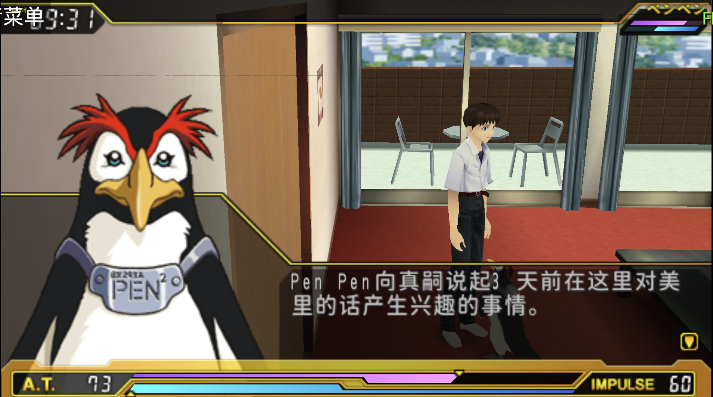
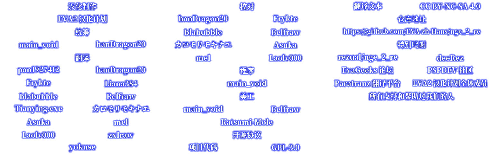
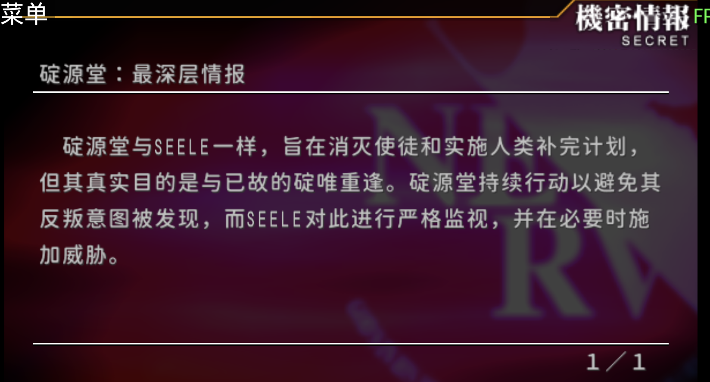
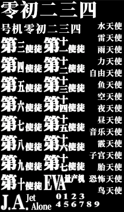

转眼间又过去了一个月，EVA2汉化补丁迎来首个大版本更新。这主要是补丁架构改变导致的，原来的<u>启动器+游戏</u>模式被替换为<u>启动器+运行时插件+游戏</u>的模式，这一改变允许更多动态修改。

# 记忆文本汉化

随着架构变化，记忆文本的汉化成为可能，参见视频

[逆转语序实现日文游戏汉化](https://www.bilibili.com/video/BV1H7Gq6zETE?cid=38583668616&p=1)

# 汉化职员表生成

此外，新增了汉化职员表的生成

# 机密情报修复

对于机密情报死机的问题，这次更新也做了相应的修改

# 贴图翻译更新

除此之外，游戏中的文本和贴图翻译也进行了更新。

# 文本更新

## 修改

-  重译了多处关键对话，使表达更精准自然，例如“痛苦到我不禁会去想：为什么会这么让我痛苦呢……”等（by Belfraw）
- 修改了多句剧情台词，优化措辞与语感，如“那个人……在这种时候可不能逃走”、“太帅了，大叔！”等（by blabubble）
- 调整了冬月回忆线中大量独白与对话，统一角色称呼（如“唯”→“唯君”），改善逻辑衔接（by Frykte）
- 修正了EVA构造说明文段及部分疑问语气，如“咦……是在说什么？”（by hanDragon20）
- 修正了“又要逃走吗？”→“又要逃避吗？”（by Tianying.exe）

## 润色

- 润色了多句教学与战斗台词，使语气更符合角色性格（by blabubble）
- 优化了冬月相关剧情中的叙述性文字，提升可读性（by Frykte）
- 调整了部分标点符号与换行格式，统一排版（by Frykte）

## 杂项

- 调整了若干条翻译的审理阶段状态（by main_void / Belfraw / hanDragon20 / blabubble）

## 贡献者修改统计

- Frykte: 261 条
- blabubble: 173 条
- hanDragon20: 39 条
- main_void: 7 条
- Belfraw: 5 条
- Tianying.exe: 1 条

# 总结

以上就是本次 v2.0.0-beta.1 更新的主要内容，xdelta3补丁仍在GitHub Release发布。欢迎各位朋友下载测试。
